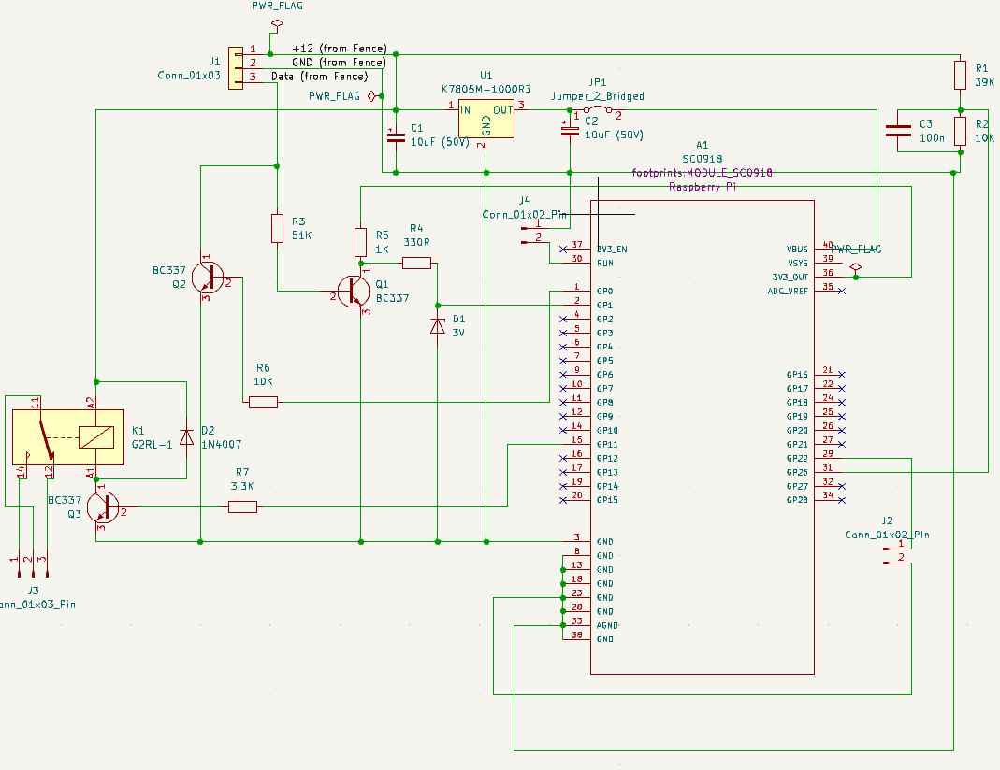

# MQTT-Nemtek
Pretends to be a Nemtek Keypad for a Druid Energiser - allows integration to Home Assistant.

## Disclaimer

This code and any procedures or hardware modifications are "use at your own risk" and is not intended for any safety critical applications. While care has been taken to ensure the reliability of the code it is largly untested beyond one specific installation and we are integrating hobby level microcontrollers into a commercial product, and these are not rated for safety in any way. Only proceed if you understand this and know what you are doing. If you need to isolate the fence safety, it is reccomended to physically disconnect the micro-controller from the fence/keypad bus. No support is offered with this code, but I will look at issues as and when I find time.

## Hardware

### BoM

For now, this is breadboarded, but you could set it up on vero board or roll your own PCB for testing. I will put together a PCB layout and case in later versions of this project.
The BoM so far is:
1. Pico_W, although you could probably with minor changes compile this for a Pico_2W.
2. 2x BC337 (only 1 needed for monitoring). You could substitute any similar NPN from your parts bin.
3. 1k Resistor
4. 51k Resistor
5. 330R Resistor
6. 3V Zener (optional, holdover from previous iterations)
7. 39k Resistor
8. 2x10k Resistor
9. 100nF ceramic capacitor
9. K7805M-1000R3 (and associated decouping capacitors). You can use any other switch mode 5V regulator. Do not use a linear regulator or you may pull too much power from the energiser. If you are concerned about the energiser battery, you can power the pico externally from whatever 5V supply you think is appropriate.

### Circuit Diagrams

## Building

Import the code into VSCODE as from the Pi Pico extention. Copy **config.example.h** to **config.h** and input your settings into it. Alternatively, use and test the commissioning mode. The pico presents as a UART on connection to a PC, and you can use your favourite serial terminal program to configure the settings. Be sure to fill in all fields. Leaving them blank will blank them at this point.

## Commisioning Mode

During startup, with the pico connected to a PC, you will be prompted to press 'c' to enter config mode. You can set all parameters including the master pin here, if you didn't already set them during build in the master config.h file. 

## Keypad Emulation

The system will try autodetect which of the two possible keypads is free. If you already have two keypads, it will disable control of the energiser as the energiser only allows for one keypad. If you have no keypads, it will select based on if pin 22 is grounded (keypad 1) or not (keypad 2).

## Home Assistant Config

We authenticate on the MQTT server. So, make sure you create a user for this device. Everything should just populate.

## Known issues

1. Some tags are the wrong type so don't come through properly.
2. The alarm history status and service mode tags are not tracked at this point.
3. Not every possible bit in the protocol is mapped yet.
4. Only arming and disarming is implemented right now.
5. Pico WiFi doesn't play nice with all routers. Use a static IP to be sure.
6. There may still be a memory leak in the experimental branch.

If you are able to assist with raw packets and the state of the LEDs or LCD on you energizer that corresponds to the raw packets, the code can be improved.

